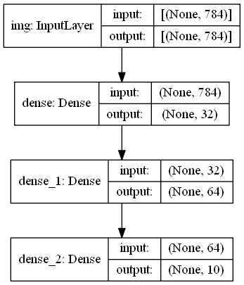

# 1.2 keras函数api
除了使用序列模型，我们还可以根据自己的需求自定义模型，下面我们以mnist手写字体识别问题为例：
## 1.构建简单的网络
### 1.1 创建网络


```python
import tensorflow as tf
import tensorflow.keras as keras
from tensorflow.keras import layers
```


```python
inputs = tf.keras.Input(shape=(784,), name='img')
h1 = layers.Dense(32, activation='relu')(inputs)
h2 = layers.Dense(64, activation='relu')(h1)
outputs = layers.Dense(10, activation='softmax')(h2)
model = tf.keras.Model(inputs=inputs, outputs=outputs, name='mnist model')

model.summary()
keras.utils.plot_model(model, '../models/minst_model.png')
keras.utils.plot_model(model, '../models/minst_info.png', show_shapes='True')
```

    Model: "mnist model"
    _________________________________________________________________
    Layer (type)                 Output Shape              Param #   
    =================================================================
    img (InputLayer)             [(None, 784)]             0         
    _________________________________________________________________
    dense (Dense)                (None, 32)                25120     
    _________________________________________________________________
    dense_1 (Dense)              (None, 64)                2112      
    _________________________________________________________________
    dense_2 (Dense)              (None, 10)                650       
    =================================================================
    Total params: 27,882
    Trainable params: 27,882
    Non-trainable params: 0
    _________________________________________________________________
    





### 1.2 验证及测试
同样使用test1中mnist数据集进行测试，并对数据进行相同的处理：


```python
(x_train, y_train), (x_test, y_test) = keras.datasets.mnist.load_data()
x_train = x_train.reshape(60000, 784).astype('float32') /255
x_test = x_test.reshape(10000, 784).astype('float32') /255
model.compile(optimizer=keras.optimizers.RMSprop(),
             loss='sparse_categorical_crossentropy', # 直接填api，后面会报错
             metrics=['accuracy'])
history = model.fit(x_train, y_train, batch_size=64, epochs=5, validation_split=0.2)
test_scores = model.evaluate(x_test, y_test, verbose=0)
print('test loss:', test_scores[0])
print('test acc:', test_scores[1])
```

    WARNING: Logging before flag parsing goes to stderr.
    W0913 15:19:55.235465 14516 deprecation.py:323] From D:\Anaconda3\envs\tf2\lib\site-packages\tensorflow\python\ops\math_grad.py:1250: add_dispatch_support.<locals>.wrapper (from tensorflow.python.ops.array_ops) is deprecated and will be removed in a future version.
    Instructions for updating:
    Use tf.where in 2.0, which has the same broadcast rule as np.where
    

    Train on 48000 samples, validate on 12000 samples
    Epoch 1/5
    48000/48000 [==============================] - 6s 131us/sample - loss: 0.4156 - accuracy: 0.8832 - val_loss: 0.2215 - val_accuracy: 0.9351
    Epoch 2/5
    48000/48000 [==============================] - 5s 104us/sample - loss: 0.2120 - accuracy: 0.9375 - val_loss: 0.1818 - val_accuracy: 0.9470
    Epoch 3/5
    48000/48000 [==============================] - 5s 106us/sample - loss: 0.1691 - accuracy: 0.9505 - val_loss: 0.1666 - val_accuracy: 0.9504
    Epoch 4/5
    48000/48000 [==============================] - 5s 105us/sample - loss: 0.1430 - accuracy: 0.9585 - val_loss: 0.1436 - val_accuracy: 0.9570
    Epoch 5/5
    48000/48000 [==============================] - 5s 110us/sample - loss: 0.1256 - accuracy: 0.9630 - val_loss: 0.1346 - val_accuracy: 0.9601
    test loss: 0.13311033908994868
    test acc: 0.9624
    

### 1.3 模型保存和序列化


```python
model.save('../models/model_save.h5')
del model
model = keras.models.load_model('../models/model_save.h5')
```

## 2 使用共享网络创建多个模型

在函数API中，可以通过指定网络层的输入和输出来构建模型，这意味着可以和变量一样迭代更新网络层来生成多个模型，下面是一个编码器和解码器的例子：


```python
encode_input = keras.Input(shape=(28,28,1),name='image') # 输入28*28的灰度图像
h1 = layers.Conv2D(16, 3, activation='relu')(encode_input)# 2维的卷积层，fliter数目为16，window_size为3
h1 = layers.Conv2D(32, 3, activation='relu')(h1)
h1 = layers.MaxPool2D(3)(h1)
h1 = layers.Conv2D(32, 3, activation='relu')(h1)
h1 = layers.Conv2D(16, 3, activation='relu')(h1)
encode_output = layers.GlobalMaxPool2D()(h1)
encode_model = keras.Model(inputs=encode_input, outputs=encode_output, name="encoder")
encode_model.summary()
```

    Model: "encoder"
    _________________________________________________________________
    Layer (type)                 Output Shape              Param #   
    =================================================================
    image (InputLayer)           [(None, 28, 28, 1)]       0         
    _________________________________________________________________
    conv2d (Conv2D)              (None, 26, 26, 16)        160       
    _________________________________________________________________
    conv2d_1 (Conv2D)            (None, 24, 24, 32)        4640      
    _________________________________________________________________
    max_pooling2d (MaxPooling2D) (None, 8, 8, 32)          0         
    _________________________________________________________________
    conv2d_2 (Conv2D)            (None, 6, 6, 32)          9248      
    _________________________________________________________________
    conv2d_3 (Conv2D)            (None, 4, 4, 16)          4624      
    _________________________________________________________________
    global_max_pooling2d (Global (None, 16)                0         
    =================================================================
    Total params: 18,672
    Trainable params: 18,672
    Non-trainable params: 0
    _________________________________________________________________
    


```python
decode_input = keras.Input(shape=(16,), name='encoded_img')
h2 = layers.Reshape((4, 4, 1))(decode_input)
h2 = layers.Conv2DTranspose(16, 3, activation='relu')(h2) # 反卷积
h2 = layers.Conv2DTranspose(32, 3, activation='relu')(h2)
h2 = layers.UpSampling2D(3)(h2) # 超采样
h2 = layers.Conv2DTranspose(16, 3, activation='relu')(h2)
decode_output = layers.Conv2DTranspose(1, 3, activation='relu')(h2)
decode_model = keras.Model(inputs=decode_input, outputs=decode_output, name='decoder')
decode_model.summary()
```

    Model: "decoder"
    _________________________________________________________________
    Layer (type)                 Output Shape              Param #   
    =================================================================
    encoded_img (InputLayer)     [(None, 16)]              0         
    _________________________________________________________________
    reshape (Reshape)            (None, 4, 4, 1)           0         
    _________________________________________________________________
    conv2d_transpose (Conv2DTran (None, 6, 6, 16)          160       
    _________________________________________________________________
    conv2d_transpose_1 (Conv2DTr (None, 8, 8, 32)          4640      
    _________________________________________________________________
    up_sampling2d (UpSampling2D) (None, 24, 24, 32)        0         
    _________________________________________________________________
    conv2d_transpose_2 (Conv2DTr (None, 26, 26, 16)        4624      
    _________________________________________________________________
    conv2d_transpose_3 (Conv2DTr (None, 28, 28, 1)         145       
    =================================================================
    Total params: 9,569
    Trainable params: 9,569
    Non-trainable params: 0
    _________________________________________________________________
    

也可以将整个模型作为一层网络使用：


```python
autoencoder_input = keras.Input(shape=(28, 28, 1), name='img')
h3 = encode_model(autoencoder_input)
autoencoder_output = decode_model(h3)
autoencoder = keras.Model(inputs=autoencoder_input, outputs=autoencoder_output, name='autoencoder')
autoencoder.summary()
```

    Model: "autoencoder"
    _________________________________________________________________
    Layer (type)                 Output Shape              Param #   
    =================================================================
    img (InputLayer)             [(None, 28, 28, 1)]       0         
    _________________________________________________________________
    encoder (Model)              (None, 16)                18672     
    _________________________________________________________________
    decoder (Model)              (None, 28, 28, 1)         9569      
    =================================================================
    Total params: 28,241
    Trainable params: 28,241
    Non-trainable params: 0
    _________________________________________________________________
    

## 3. 构建多输入与多输出网络
建一个根据文档内容、标签和标题，预测文档优先级和执行部门的网络。


```python
# 超参数
num_words = 2000
num_tags = 12
num_departments = 4

# 输入
body_input = keras.Input(shape=(None, ), name='body')
title_input = keras.Input(shape=(None, ), name='title')
tag_input = keras.Input(shape=(num_tags, ), name='tag')

# 嵌入层
body_feat = layers.Embedding(num_words, 64)(body_input)
title_feat = layers.Embedding(num_words, 64)(title_input)

# 特征提取层
body_feat = layers.LSTM(32)(body_feat)
title_feat = layers.LSTM(128)(title_feat)
features = layers.concatenate([title_feat, body_feat, tag_input])

# 分类层
priority_pred = layers.Dense(1, activation='sigmoid', name='priority')(features)
department_pred = layers.Dense(num_departments, activation='softmax', name='department')(features)

# 构建模型
model = keras.Model(inputs=[body_input, title_input, tag_input],
                   outputs=[priority_pred, department_pred])
model.summary()
keras.utils.plot_model(model, 'multi_model.png', show_shapes=True)
model.compile(optimizer=keras.optimizers.RMSprop(1e-3),
             loss={'priority': 'binary_crossentropy',
                  'department': 'categorical_crossentropy'},
             loss_weights=[1.,0.2])

# 构建数据
import numpy as np
title_data = np.random.randint(num_words, size=(1280, 10))
body_data = np.random.randint(num_words, size=(1280, 100))
tag_data = np.random.randint(2, size=(1280,num_tags)).astype('float32')

#构建标签
priority_label = np.random.random(size=(1280, 1))
department_label = np.random.randint(2, size=(1280, num_departments))

#训练
history = model.fit(
    {'title': title_data, 'body':body_data, 'tag': tag_data},
    {'priority': priority_label, 'department':department_label},
    batch_size=32, epochs=5)
```

    Model: "model"
    __________________________________________________________________________________________________
    Layer (type)                    Output Shape         Param #     Connected to                     
    ==================================================================================================
    title (InputLayer)              [(None, None)]       0                                            
    __________________________________________________________________________________________________
    body (InputLayer)               [(None, None)]       0                                            
    __________________________________________________________________________________________________
    embedding_1 (Embedding)         (None, None, 64)     128000      title[0][0]                      
    __________________________________________________________________________________________________
    embedding (Embedding)           (None, None, 64)     128000      body[0][0]                       
    __________________________________________________________________________________________________
    lstm_1 (LSTM)                   (None, 128)          98816       embedding_1[0][0]                
    __________________________________________________________________________________________________
    lstm (LSTM)                     (None, 32)           12416       embedding[0][0]                  
    __________________________________________________________________________________________________
    tag (InputLayer)                [(None, 12)]         0                                            
    __________________________________________________________________________________________________
    concatenate (Concatenate)       (None, 172)          0           lstm_1[0][0]                     
                                                                     lstm[0][0]                       
                                                                     tag[0][0]                        
    __________________________________________________________________________________________________
    priority (Dense)                (None, 1)            173         concatenate[0][0]                
    __________________________________________________________________________________________________
    department (Dense)              (None, 4)            692         concatenate[0][0]                
    ==================================================================================================
    Total params: 368,097
    Trainable params: 368,097
    Non-trainable params: 0
    __________________________________________________________________________________________________
    Train on 1280 samples
    Epoch 1/5
    1280/1280 [==============================] - 5s 4ms/sample - loss: 1.2577 - priority_loss: 0.6982 - department_loss: 2.7977
    Epoch 2/5
    1280/1280 [==============================] - 1s 1ms/sample - loss: 1.2218 - priority_loss: 0.6708 - department_loss: 2.7550
    Epoch 3/5
    1280/1280 [==============================] - 1s 1ms/sample - loss: 1.1366 - priority_loss: 0.5950 - department_loss: 2.7077
    Epoch 4/5
    1280/1280 [==============================] - 1s 1ms/sample - loss: 1.0671 - priority_loss: 0.5396 - department_loss: 2.6373
    Epoch 5/5
    1280/1280 [==============================] - 1s 1ms/sample - loss: 1.0305 - priority_loss: 0.5200 - department_loss: 2.5525
    

可以看到，多输入采用的是特征提取后的拼接；而多输出是在最后一层网络中分别构建对应的预测规则，并在模型搭建的时候对输出做拼接。

## 4. 共享网络层
将一个网络定义之后可以使用类似函数的形式进行调用，参数是该网络的输入。


```python
share_embedding = layers.Embedding(100, 64)

input1 = keras.Input(shape=(None, ), dtype='int32')
input2 = keras.Input(shape=(None, ), dtype='int32')

feat1 = share_embedding(input1)
feat2 = share_embedding(input2)
```

## 5. 已有模型复用
可以通过调用`tensorflow.keras.applicaions`中预定义的网络模型，使用该模型的某些层进行复用。


```python
from tensorflow.keras.applications import VGG16
vgg16=VGG16()

feature_list = [layer.output for layer in vgg16.layers]
feat_ext_model = keras.Model(inputs=vgg16.input, outputs=feature_list)

img = np.random.random((1, 224, 224, 3).astype('float32'))
ext_features = feat_ext_model(img)
```

    Downloading data from https://github.com/fchollet/deep-learning-models/releases/download/v0.1/vgg16_weights_tf_dim_ordering_tf_kernels.h5
       483328/553467096 [..............................] - ETA: 18:01:40
